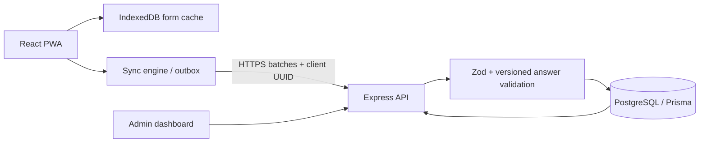

# FieldSync

## Problem statement

NGOs, researchers, and college clubs collect data in places with poor or no internet. Paper forms are easy to lose and difficult to transcribe accurately.

## Target users

- **Admins** create and version surveys, assign workers, monitor submissions, map locations, and export CSV.
- **Field workers** fill assigned forms offline, sync later, and review rejected submissions.

## Solution and key features

FieldSync is an offline-first survey app. It caches the app shell and assigned forms, stores submissions in IndexedDB, and synchronizes an idempotent outbox when the network returns. The server checks worker access and revalidates answers against the submitted form version. Admins can manage worker accounts and forms, review response tables and a Leaflet map, and export CSV.

Implemented form fields: text, number, single and multiple choice, date, and GPS capture. Conditional fields use `fieldId` and `equals`. Edits publish a new immutable form version; old responses keep their original version.

## Tech stack

React, Vite, TypeScript, PWA/Workbox, Tailwind CSS, Dexie/IndexedDB, Node.js, Express, Zod, PostgreSQL, Prisma, JWT, bcrypt, Leaflet/OpenStreetMap, Vitest, Supertest.

## Architecture



## Sync protocol

Each local response receives a UUID `clientId` and its `formVersionId` at collection time. The client posts batches to `/api/sync`; network failures leave rows retryable with capped exponential backoff. A unique database constraint on `clientId` turns duplicate submissions into `DUPLICATE` success. The API verifies the exact version and current worker assignment, then validates required fields, conditional visibility, choice values, and number limits. The response is per item: `ACCEPTED`, `DUPLICATE`, or `REJECTED` with reasons. Workers can repair rejected records locally and submit the same client ID again because rejected items have not been persisted.

## Local setup

Prerequisites: Node.js 20+, npm 10+, and Docker Desktop (or PostgreSQL 16).

From a fresh clone, run these commands from the repository root:

```sh
npm run setup
npm run demo
```

`setup` creates ignored `server/.env` and `client/.env` files from their examples if needed, generates random local JWT secrets, starts Docker PostgreSQL on host port `5433`, waits for its health check, installs dependencies when absent, generates Prisma Client, applies migrations, and seeds the local database. On a fresh start, `demo` repeats setup, builds all workspaces, and runs the API and production Vite preview together. It detects an existing healthy service and starts a missing counterpart without duplicating processes or rebuilding Prisma while the API is using its native engine. If both are already healthy, it prints their URLs and exits successfully.

- Production preview: http://localhost:4173
- API health: http://localhost:3001/api/health
- Vite development mode (optional): `npm run dev` at http://localhost:5173

If install or a manual build fails on Windows with `EPERM` unlinking Rollup or renaming Prisma's query-engine file, close running FieldSync/Vite/Node processes that use this checkout and retry. A running API can lock the Prisma engine during generation, and a running preview can lock files under `node_modules` during a clean install. `npm run demo` avoids regenerating/rebuilding components already in use when it can safely start only the missing service.

Local development only credentials (never use or publish these for production): `admin@fieldsync.demo` / `AdminDemo123!`; `amina@fieldsync.demo` and `leo@fieldsync.demo` / `WorkerDemo123!`. Fresh local seeds use these fallback passwords only when `NODE_ENV` is not `production` and seed password variables are unset. Production seeding refuses to run unless both seed password variables are provided; use unique, strong values and never seed demo accounts on a public deployment.

## Environment variables

| Variable | Purpose | Example |
| --- | --- | --- |
| `DATABASE_URL` | PostgreSQL connection | Local URL in `server/.env.example` |
| `JWT_ACCESS_SECRET` | Signs short-lived access JWTs | Generate a random secret |
| `JWT_REFRESH_SECRET` | Signs refresh JWTs | Generate a different random secret |
| `CLIENT_ORIGIN` | Comma-separated allowed browser origins | `http://localhost:5173,http://localhost:4173` |
| `PORT` | API listen port | `3001` |
| `VITE_API_URL` | Client API base | `http://localhost:3001/api` |
| `SEED_ADMIN_PASSWORD` | Admin password for an intentional seed run | Unique strong secret; blank uses local-only fallback outside production |
| `SEED_WORKER_PASSWORD` | Shared worker password for an intentional seed run | Unique strong secret; blank uses local-only fallback outside production |

No production secrets belong in Git. `.env` files are ignored.

## Testing and production build

- Tests: `npm test` (shared evaluator/answer/retry tests and API tests).
- Production build: `npm run build`.
- Production browser E2E: `npx playwright install chromium` (once per machine), then `npm run e2e`. This builds the client and API, starts the API and Vite preview against the local PostgreSQL database, and runs the offline browser scenarios.
- Health check: `GET /api/health`.

### How the offline sync was verified

The Playwright suite runs against the production build and a real Chromium browser. It logs in as a seeded worker, lets the service worker cache the app and assigned form, switches the browser context offline, reloads, and queues three responses locally. It restores connectivity, expires the access token to exercise refresh, triggers sync twice quickly, and checks that valid UUIDs are stored once while the invalid record is visibly rejected with its server reason. It also edits and resubmits the rejected record with the same UUID. Run `npm run setup` before `npm run e2e` on a fresh checkout.

The local verification run also exercised the seeded PostgreSQL API: duplicate UUID retries returned `DUPLICATE`, an invalid response returned a field reason and was accepted after fixing with the same UUID, worker queries stayed scoped to the signed-in worker, unassigned workers received no forms, and CSV export contained the submitted response.

## Deployment

Vercel monorepo build/SPA configuration is in the root `vercel.json` (with a client-level SPA rewrite in `client/vercel.json`); Render API configuration is in `render.yaml`. Render applies Prisma migrations during deploy. Follow [docs/DEPLOY.md](docs/DEPLOY.md) to configure PostgreSQL, CORS, and `VITE_API_URL`.

Frontend live URL: `https://<your-project>.vercel.app`  
API live URL: `https://<your-service>.onrender.com`

## Operational notes

- Browser storage can be cleared or evicted; workers should sync before clearing site data.
- Sync runs when the app opens, connectivity returns, or the worker selects Sync now; cross-browser background sync is not required.
- GPS capture requires browser location permission and an available location sensor. Coordinates can also be edited directly in the response form.
- Live hosting, production credentials, demo recording, and submission steps require deployment-specific setup.

## Design decisions

- **Idempotency keys:** a client UUID plus a database unique constraint makes duplicate retries safe after interrupted connections.
- **Form versioning:** responses point to immutable form versions so later edits do not change how historical data is interpreted.
- **Server revalidation:** offline client checks improve feedback, while authoritative server checks protect data integrity and enforce current assignment permissions.
