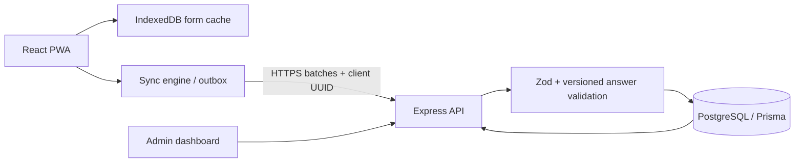

# FieldSync

## Problem statement

NGOs, researchers, and college clubs collect data in places with poor or no internet. Paper forms are easy to lose and difficult to transcribe accurately.

## Target users

- **Admins** create and version surveys, assign workers, monitor submissions, map locations, and export CSV.
- **Field workers** fill assigned forms offline, sync later, and review rejected submissions.

## Solution and key features

FieldSync is an offline-first survey app. It caches the app shell and assigned forms, stores submissions in IndexedDB, and synchronizes an idempotent outbox when the network returns. The server checks worker access and revalidates answers against the submitted form version. Admins can manage worker accounts and forms, review response tables and a Leaflet map, and export CSV.

Implemented form fields: text, number, single and multiple choice, date, and GPS capture. Conditional fields use `fieldId` and `equals`. Edits publish a new immutable form version; old responses keep their original version.

## Tech stack

React, Vite, TypeScript, PWA/Workbox, Tailwind CSS, Dexie/IndexedDB, Node.js, Express, Zod, PostgreSQL, Prisma, JWT, bcrypt, Leaflet/OpenStreetMap, Vitest, Supertest.

## Architecture

## Sync protocol

Each local response receives a UUID `clientId` and its `formVersionId` at collection time. The client posts batches to `/api/sync`; network failures leave rows retryable with capped exponential backoff. A unique database constraint on `clientId` turns duplicate submissions into `DUPLICATE` success. The API verifies the exact version and current worker assignment, then validates required fields, conditional visibility, choice values, and number limits. The response is per item: `ACCEPTED`, `DUPLICATE`, or `REJECTED` with reasons. Workers can repair rejected records locally and submit the same client ID again because rejected items have not been persisted.

## Local setup

Prerequisites: Node.js 20+, npm 10+, and Docker Desktop (or PostgreSQL 16).

1. Copy `server/.env.example` to `server/.env` and set long random JWT secrets. Copy `client/.env.example` to `client/.env` if the API URL differs.
2. Start PostgreSQL: `docker compose up -d`.
3. Install dependencies from the root: `npm install`.
4. Generate Prisma client and apply migrations: `npm run db:migrate --workspace=server`.
5. Load demo data: `npm run db:seed --workspace=server`.
6. Start API and Vite together: `npm run dev` (API port 3001, client port 5173).

Demo accounts: `admin@fieldsync.demo` / `AdminDemo123!`; `amina@fieldsync.demo` and `leo@fieldsync.demo` / `WorkerDemo123!`. These are local demo credentials; change them before any shared deployment.

## Environment variables

| Variable | Purpose | Example |
| --- | --- | --- |
| `DATABASE_URL` | PostgreSQL connection | Local URL in `server/.env.example` |
| `JWT_ACCESS_SECRET` | Signs short-lived access JWTs | Generate a random secret |
| `JWT_REFRESH_SECRET` | Signs refresh JWTs | Generate a different random secret |
| `CLIENT_ORIGIN` | Allowed browser origin | `http://localhost:5173` |
| `PORT` | API listen port | `3001` |
| `VITE_API_URL` | Client API base | `http://localhost:3001/api` |

No production secrets belong in Git. `.env` files are ignored.

## Testing and production build

- Tests: `npm test` (shared evaluator/answer/retry tests and API tests).
- Production build: `npm run build`.
- Health check: `GET /api/health`.

## Deployment

Vercel SPA configuration is in `client/vercel.json`; Render API configuration is in `render.yaml`. Render applies Prisma migrations during deploy. Follow [docs/DEPLOY.md](docs/DEPLOY.md) to configure PostgreSQL, CORS, and `VITE_API_URL`.

Frontend live URL: `https://<your-project>.vercel.app`  
API live URL: `https://<your-service>.onrender.com`

## Known limitations

- Browser storage can be cleared by the user or evicted by the browser; workers should sync before clearing site data.
- This initial client does not use background sync on all browsers; it syncs on app open, network restoration, and the manual button.
- Rejected submissions can be corrected in the local outbox; editing supports common scalar fields. For structured multi-select and GPS corrections, the response can be recreated from the form.
- Dashboard filtering currently supports form selection and pagination on the API; additional worker/date/status controls can be added.
- GPS requires browser permission and a device location sensor.
- Deployment, production credentials, demo recording, and submission form remain manual.

## Design decisions

- **Idempotency keys:** a client UUID plus a database unique constraint makes duplicate retries safe after interrupted connections.
- **Form versioning:** responses point to immutable form versions so later edits do not change how historical data is interpreted.
- **Server revalidation:** offline client checks improve feedback, while authoritative server checks protect data integrity and enforce current assignment permissions.
